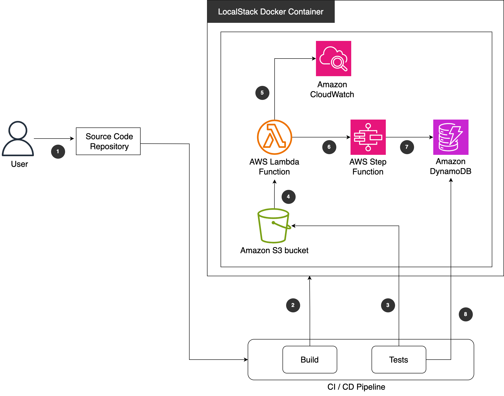

# Testing AWS infrastructure using LocalStack and Terraform Test

This pattern provides a solution to test IaC in Terraform locally without the need to provision infrastructure in AWS. It uses the [Terraform Test framework](https://developer.hashicorp.com/terraform/language/tests) introduced with Terraform version 1.6 and we showcase how to integrate it with LocalStack for Cost Optimization, Speed and Efficiency, Consistency and Reproducibility, Isolation and Safety and Simplified Development Workflow.

Running tests against LocalStack eliminates the need to use actual AWS services, thus avoiding costs associated with creating, modifying, and destroying resources in AWS. Testing locally is significantly faster than deploying resources in AWS.

This rapid feedback loop accelerates development and debugging. Since LocalStack runs locally, you can develop and test your Terraform scripts without an internet connection. LocalStack provides a consistent environment for testing. This consistency ensures that tests yield the same results regardless of external AWS changes or network issues.

Integration with a CI/CD pipeline allows for automated testing of Terraform scripts and modules. This ensures infrastructure code is thoroughly tested before deployment. Testing with LocalStack ensures that you don't accidentally affect live AWS resources or production environments. This isolation makes it safe to experiment and test various configurations. Developers can debug Terraform scripts locally with immediate feedback, streamlining the development process.

You can simulate different AWS regions, accounts, and service configurations to match your production environments more closely.

## Prerequisites

- Docker Installed and configured to enable default Docker socket (/var/run/docker.sock).

- [Docker Installation Guide for Linux](https://docs.docker.com/engine/install/).

- [Docker Desktop for Windows](https://docs.docker.com/desktop/install/windows-install/).

- [Docker Desktop for Mac](https://docs.docker.com/desktop/install/mac-install/).

- Docker Compose [installed](https://docs.docker.com/compose/install/).

- AWS Command Line Interface (AWS CLI), [installed](https://docs.aws.amazon.com/cli/latest/userguide/getting-started-install.html) and [configured](https://docs.aws.amazon.com/cli/latest/userguide/cli-configure-files.html).

- Terraform CLI, [installed](https://developer.hashicorp.com/terraform/cli) (Terraform documentation).

- Terraform AWS Provider, [configured](https://hashicorp.github.io/terraform-provider-aws/) (Terraform documentation).

## Target architecture

The code in this repository helps you set up the following target architecture.



The diagram illustrates a CI/CD pipeline for a LocalStack Docker Container setup. Here's a breakdown of the components and their interactions:

**Source Code Repository**

  1. A user commits code changes to a Source Code Repository.

**CI/CD Pipeline**

  2. The code changes trigger a Build process.

  3. The Build process also triggers Tests to ensure the code changes are functional.

**LocalStack Docker Container**

  The LocalStack Docker Container hosts the following AWS services locally:

  4. An Amazon S3 bucket for storing files.

  5. Amazon CloudWatch for monitoring and logging.

  6. An AWS Lambda Function for running serverless code.

  7. An AWS Step Function for orchestrating multi-step workflows.

  8. An Amazon DynamoDB for storing NoSQL data.

**Workflow**

- The user commits code changes to the Source Code Repository (1).

- The CI/CD Pipeline detects the changes and triggers a Build process for static Terraform code analysis and for building the LocalStack Docker container (2) and running the Tests (3). The Test stage runs the tests for our infrastructure against LocalStack without deploying any resources in AWS Cloud (Steps 3-8).

Within the LocalStack Docker Container the test:

- uploads an object into an S3 bucket (Step 4),

- invokes an AWS Lambda function through an Amazon S3 event notification (Step 4) with logs stored on Amazon CloudWatch (Step 5),

- which in turn will start the execution of a state machine (Step 6),

- that will write the name of the S3 object into a DynamoDB table (Step 7).

- We then verify that the name of the object uploaded matches the entry in the DynamoDB table (Step 8).

The provided tests include also examples to verify that the S3 bucket is deployed with the given name and that the AWS Lambda function has been successfully deployed.

The LocalStack Docker Container provides a local development environment that emulates various AWS services, allowing developers to test and iterate on their applications without incurring costs on the actual AWS Cloud.

## Terraform Test

### Run Local Stack Container

In the cloned repository start Local Start Docker execution in detached mode by enter the following command in bash shell.

```shell
docker compose up -d
```

Wait until the Local Stack container is up and running.

### Terraform Initialization

Enter the following command from the cloned repsotiory to initialize Terraform.

```shell
terraform init
```

### Run Terraform Test

Enter the following command to execute Terraform Test.

```shell
terraform test
```

Verify that all tests successfully passed.

The output should be similar to:
```shell
tests/localstack.tftest.hcl... in progress
  run "check_s3_bucket_name"... pass
  run "check_lambda_function"... pass
  run "check_name_of_filename_written_to_dynamodb"... pass
tests/localstack.tftest.hcl... tearing down
tests/localstack.tftest.hcl... pass

Success! 3 passed, 0 failed.
```

### Resource Cleanup

Enter the following command to destroy Local Stack Container.

```shell
docker compose down
```


## Debugging with AWS CLI

### Run Local Stack Container

In the cloned repository start Local Start Docker execution in detached mode by enter the following command in bash shell.

```shell
docker-compose up -d
```

Wait until the Local Stack container is up and running.


### Authentication

Export the following environment variable to be able to run AWS CLI commands in the local running container that emulates AWS Cloud.

```shell
export AWS_ACCESS_KEY_ID=test
export AWS_SECRET_ACCESS_KEY=test
export AWS_SESSION_TOKEN=test
export AWS_REGION=eu-central-1
```

### Create Resources Locally

Create resources in the local running container.

```shell
terraform init
terraform plan
terraform apply -auto-approve
```

You can finally execute AWS CLI commands on the deployed resources for example to check that a state machine has been created.
```shell
aws --endpoint-url http://localhost:4566 stepfunctions list-state-machines
```

### Destroy the resources

```shell
terraform destroy -auto-approve
```

Enter the following command to destroy Local Stack Container.
```shell
docker compose down
```

## GitHub Actions

We provide an example how to integrate LocalStack and Terraform Test in a CI/CD pipeline with [GitHub Actions](.github/workflows/localstack-terraform-test.yml).

## Authors

Pattern created by Ivan Girardi (AWS) and Ioannis Kalyvas (AWS).

## Security

See [CONTRIBUTING](CONTRIBUTING.md#security-issue-notifications) for more information.

## License

This library is licensed under the MIT-0 License. See the LICENSE file.
